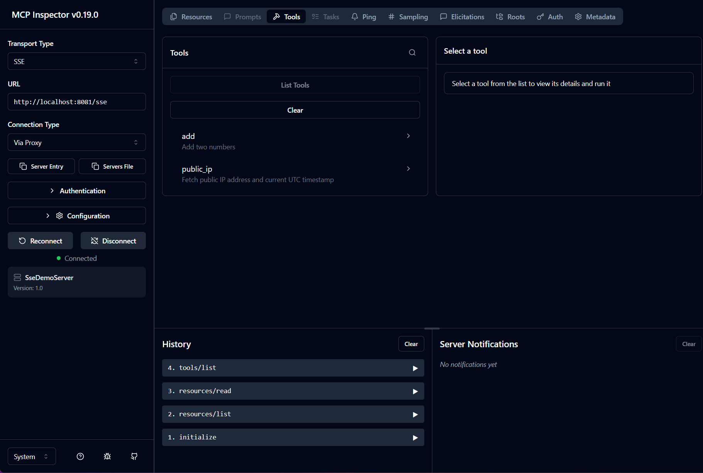

# mormot.ext.mcp
Pure mORMot v2 implementation of the Model Context Protocol (MCP) with JSON‑RPC 2.0, HTTP/SSE and stdio transports.

## Quick start
- Build the demos and tests with Delphi or FPC.
- Run the tests: `mcp.tests`

### Next step
- Integrate the MCP server into your favorite tool - see [preview](#preview)

## Demos (each is a separate program)
- `demo.mcp.jsonrpc`  
  In‑process JSON‑RPC demo (no network).
- `demo.mcp.http [port]`  
  HTTP MCP server.
- `demo.mcp.sse [port]`  
  HTTP/SSE MCP server.
- `demo.mcp.stdio`  
  Line‑delimited JSON‑RPC over stdin/stdout (for CLI/agent/RPC integration).

## MCP Inspector
You can explore your MCP server using the official MCP Inspector. Just run `pnpx @modelcontextprotocol/inspector` (`NodeJS` is required)

## Notes
- `public_ip` uses `https://api.ipify.org?format=json`.
- The stdio transport accepts UTF‑8 and UTF‑16LE input.

## Tested compilers (2026-02-02)
- Delphi 12.3 Athens (Win32)
- Free Pascal 3.3.1 (Linux x64/Win64)

## TODO:
[ ] Add `TRestServerMCP`  
- **Authentication**  
  [ ] mORMot Native Auth  
  [ ] JWT  
  [ ] OAUTH2  
[ ] Implement Streamable HTTP (protocol version 2026-03-26)  

## Preview
<video src="https://raw.githubusercontent.com/flydev-fr/mormot2-extensions/main/mormot-mcp-server/docs/medias/mcp-from-warp.mp4" controls muted></video>
### MCP Inspector

